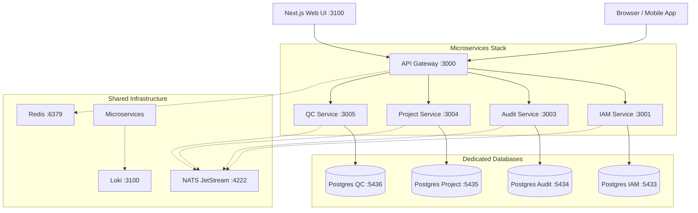

# Integrated Project Management System (iPMS)

Enterprise-grade, distributed microservices platform for project delivery tracking, site milestones, and quality control (QC) inspections with mobile offline-first capabilities.

---

## Architecture Overview



- **Microservice Isolation**: Strict **Database-per-Service** architecture where every service owns its dedicated PostgreSQL 17 database, persistent volume, and environment configuration.
- **Asynchronous Events**: Event-driven communication via **NATS JetStream**.
- **Edge Routing & Auth**: Unified **API Gateway** managing authentication tokens, request rate limiting, and routing.
- **Frontend & Field App**: Server-rendered **Next.js Web Dashboard** and cross-platform **Flutter Mobile App**.

---

## Service URLs & Port Mappings

| Service / Container | Host Port / URL | Internal Port | Description |
| :--- | :--- | :--- | :--- |
| **Web Dashboard** | **[http://localhost:3100](http://localhost:3100)** | `3100` | Next.js delivery tracking UI |
| **API Gateway** | **[http://localhost:3000](http://localhost:3000)** | `3000` | Reverse proxy edge router |
| **Gateway Health Check** | **[http://localhost:3000/health/ready](http://localhost:3000/health/ready)** | `3000` | Readiness probe endpoint |
| **IAM Database** | `localhost:5433` | `5432` | Dedicated DB for Identity & Access (`ipms_iam`) |
| **Audit Database** | `localhost:5434` | `5432` | Dedicated DB for Tamper-evident Audit (`ipms_audit`) |
| **Project Database** | `localhost:5435` | `5432` | Dedicated DB for Projects & Sites (`ipms_project`) |
| **QC Database** | `localhost:5436` | `5432` | Dedicated DB for Quality Control (`ipms_qc`) |
| **NATS JetStream** | `localhost:4222` | `4222` | Message broker and event streams |
| **Redis** | `localhost:6379` | `6379` | Cache, token versions & rate limits |

---

## Demo Accounts

The stack automatically provisions four demo accounts on initial boot:

| Role | Username | Password | Access Level |
| :--- | :--- | :--- | :--- |
| **Administrator** | `admin` | `password123` | Full platform administration |
| **Project Manager** | `manager` | `password123` | Project, milestone, and site management |
| **Quality Control** | `qc` | `password123` | Inspection checklist review & verification |
| **Field Engineer** | `engineer` | `password123` | Field task execution & submission |

---

## Running with Docker (Recommended)

### 1. Prerequisites
- [Docker Desktop](https://www.docker.com/products/docker-desktop/) installed and running.
- Ensure the Docker engine icon in Docker Desktop shows **"Engine running"**.

### 2. Start All Services
From the project root directory, run:

```powershell
docker compose -f docker/docker-compose.yml up -d
```

This single command will:
1. Boot the 4 dedicated PostgreSQL databases (`postgres-iam`, `postgres-audit`, `postgres-project`, `postgres-qc`), Redis, and NATS.
2. Run database migrations (`prisma migrate deploy`) and seed demo roles and credentials.
3. Start the backend microservices (`iam`, `audit`, `project`, `qc`, and `gateway`).
4. Start the `web` frontend dashboard on port `3100`.

### 3. Check System Status
Verify all containers are healthy:

```powershell
docker compose -f docker/docker-compose.yml ps
```

### 4. Open in Your Browser
- **Web UI**: Open **[http://localhost:3100](http://localhost:3100)** and sign in with `admin` / `password123`.
- **API Readiness**: Visit **[http://localhost:3000/health/ready](http://localhost:3000/health/ready)**.

### 5. View Logs
To view live logs across all containers:
```powershell
docker compose -f docker/docker-compose.yml logs -f
```

To tail logs for a specific service:
```powershell
docker compose -f docker/docker-compose.yml logs -f gateway
docker compose -f docker/docker-compose.yml logs -f web
```

### 6. Stop the Stack
To shut down all containers cleanly:
```powershell
docker compose -f docker/docker-compose.yml down
```

---

## Environment Configuration

Every microservice and database container has its own dedicated `.env` file located in [`docker/env/`](./docker/env/):

- `docker/env/iam-db.env` & `docker/env/iam.env`
- `docker/env/audit-db.env` & `docker/env/audit.env`
- `docker/env/project-db.env` & `docker/env/project.env`
- `docker/env/qc-db.env` & `docker/env/qc.env`
- `docker/env/gateway.env`
- `docker/env/web.env`

See [`docker/env/README.md`](./docker/env/README.md) for full breakdown.

---

## Local Development (Hybrid Mode)

If you prefer active hot-reloading on the frontend while running the backend and databases in Docker:

1. **Start backend and databases in Docker**:
   ```powershell
   docker compose -f docker/docker-compose.yml up -d postgres-iam postgres-audit postgres-project postgres-qc nats redis iam audit project qc gateway
   ```

2. **Run the Next.js Web UI locally**:
   ```powershell
   pnpm --filter web dev
   ```
   The local web application will be accessible at **[http://localhost:3100](http://localhost:3100)** and proxy calls to the Docker Gateway at `http://localhost:3000`.

---

## Troubleshooting & Tips

### Drive C Low Disk Space (Windows)
Docker Desktop on Windows defaults to storing its virtual disk (`ext4.vhdx`) on Drive C. To move Docker's storage to Drive D:
1. Open **Docker Desktop Settings** (⚙).
2. Go to **Resources** → **Advanced** → **Disk image location**.
3. Change the location to a folder on Drive D (e.g., `D:\DockerDesktop\data`).
4. Click **Apply & restart**.
