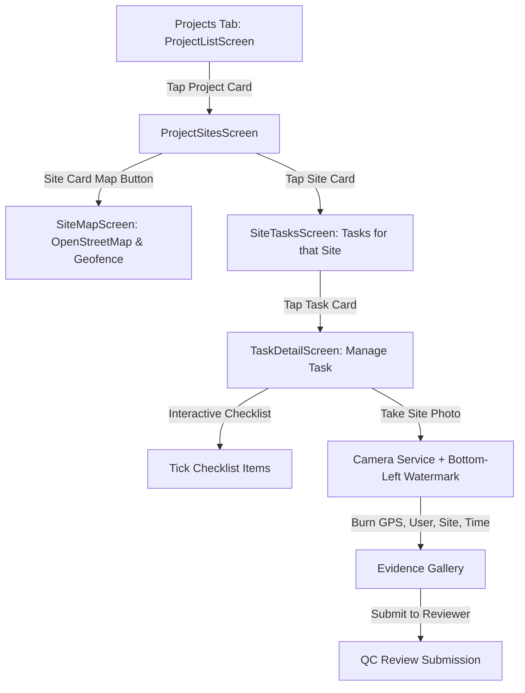

# Step-by-Step Implementation Plan: Role Access & Hierarchical Project Flow

## 1. System Role Architecture & Login Access

### Which user role can log in to the mobile app?
- **Primary Role: `FIELD_ENGINEER` (Demo Account: `engineer` / demo password)**
  - **Purpose**: Field engineers are the frontline operational users of the mobile application. They travel to physical infrastructure sites, navigate using OpenStreetMap, verify installation checklists, snap watermarked photos with burned GPS coordinates, and submit evidence for quality audit.
- **Secondary Role: `PROJECT_MANAGER` (Demo Account: `manager`)**
  - **Purpose**: Can log in to inspect site execution progress in the field or verify team tasks.
- **Web-Only Roles: `SUPER_ADMIN` (`admin`) and `QC_MANAGER` (`qc`)**
  - **Purpose**: Admins and QC Managers primarily use the **Web Portal (`apps/web`)** to create projects, configure sites, publish checklist templates, and approve/reject evidence submissions.
- **Mobile Experience**:
  - The login screen and profile screen clearly identify the logged-in role (`FIELD_ENGINEER`).

---

## 2. Hierarchical Field Navigation Flow

The flow follows the exact natural operational hierarchy:
$$\text{Assigned Project} \longrightarrow \text{Sites of that Project} \longrightarrow \text{Tasks of that Site} \longrightarrow \text{Task Execution & Watermarked Photo}$$

### Screen Breakdown:

### Step 2.1: Projects Screen (`ProjectListScreen`)
- Displays all assigned projects for the logged-in field engineer.
- Shows project code (`PRJ-5G-METRO`), name, phase, number of sites, and total tasks.
- **Action**: Tapping anywhere on the project card navigates directly to `ProjectSitesScreen` for that project.

### Step 2.2: Dedicated Sites Screen (`ProjectSitesScreen`)
- **Header**: Project title, code badge, phase, and total site count.
- **Body**: Clean list of all physical sites under this project (`KOS121`, `KOS232`, `BKT105`, `POK301`).
- **Each Site Card Displays**:
  - Site Code badge (`KOS121`)
  - Site Name & Address (`Sundhara / Ratna Park Area, Kathmandu`)
  - Task count pill (`2 Tasks assigned`)
  - Quick Action button: **"Map"** (opens OpenStreetMap focused on this site with geofence circle).
- **Primary Action**: Tapping the site card opens `SiteTasksScreen` showing only tasks belonging to this specific site.

### Step 2.3: Site Tasks Screen (`SiteTasksScreen`)
- **Header**: Site name and code (`Site Tasks • KOS121`).
- **Subheader**: Quick site coordinates (Lat/Long) and nominal geofence status.
- **Body**: Filterable list of individual tasks assigned to this site (e.g., *Civil Works & Foundation*, *5G Antenna & RF Cable Installation*).
- **Each Task Card Displays**:
  - Task Title & Category
  - Status badge (`ONGOING`, `REVIEWING`, `COMPLETED`, `BLOCKED`)
  - Priority badge (`HIGH`, `MEDIUM`, `LOW`)
  - Progress indicator & checklist count (e.g., `3/5`)
  - Assignee badge
- **Action**: Tapping any task card navigates to `TaskDetailScreen`.

### Step 2.4: Task Detail & Photo Capture Screen (`TaskDetailScreen`)
- **3 Tab Interface**:
  1. **Checklist Tab**: The official checklist items given by admins. Field engineers can interactively tap to check off completed items.
  2. **Site Evidence Tab**: Gallery of captured photos. Displays a verified badge with burned GPS coordinates. Contains the green button **"Submit Evidence to Reviewer"**.
  3. **Site & Map Tab**: OpenStreetMap view showing distance to site and geofence compliance.
- **Bottom Fixed Action**:
  - **"Take Site Photo"**: Launches hardware camera, grabs high-accuracy GPS coordinates (`geolocator`), and burns the **bottom-left watermark** (`User`, `Site Code`, `Project`, `Lat/Long`, `Timestamp`) into the photo pixels.

---

## 3. Data Flow & Riverpod Providers

1. **`projectSitesProvider(projectId)`**:
   - Returns all `ProjectSite` items for the selected project.
2. **`siteTasksProvider(siteCode)`**:
   - Returns all `TaskItem`s whose `siteCode` or `siteId` matches the selected site.
3. **`taskEvidenceProvider`**:
   - Stores captured photos in-memory tied to the specific `taskId`.
   - Tracks `isSubmitted` state when sent to QC / Project Manager.

---

## 4. Execution Steps

### Step 1: Create `ProjectSitesScreen`
- File: `apps/mobile/lib/features/projects/presentation/project_sites_screen.dart`
- Shows clean list of sites for a project.
- Navigates to `SiteTasksScreen` on tap, and to `SiteMapScreen` on map button tap.

### Step 2: Create `SiteTasksScreen`
- File: `apps/mobile/lib/features/tasks/presentation/site_tasks_screen.dart`
- Shows tasks filtered specifically for that site.
- Lets field person tap a task to enter `TaskDetailScreen`.

### Step 3: Link `ProjectListScreen` to `ProjectSitesScreen`
- Update `apps/mobile/lib/features/projects/presentation/project_list_screen.dart` so tapping any project card opens `ProjectSitesScreen(project: project)`.

### Step 4: Provider Support for Site Tasks
- In `apps/mobile/lib/features/tasks/providers/task_providers.dart`, add `siteTasksProvider(siteCode)` returning tasks for a given site.

### Step 5: Testing & Quality Gates
- Run `flutter analyze` (target: 0 issues).
- Run `flutter test` (target: all tests pass).
