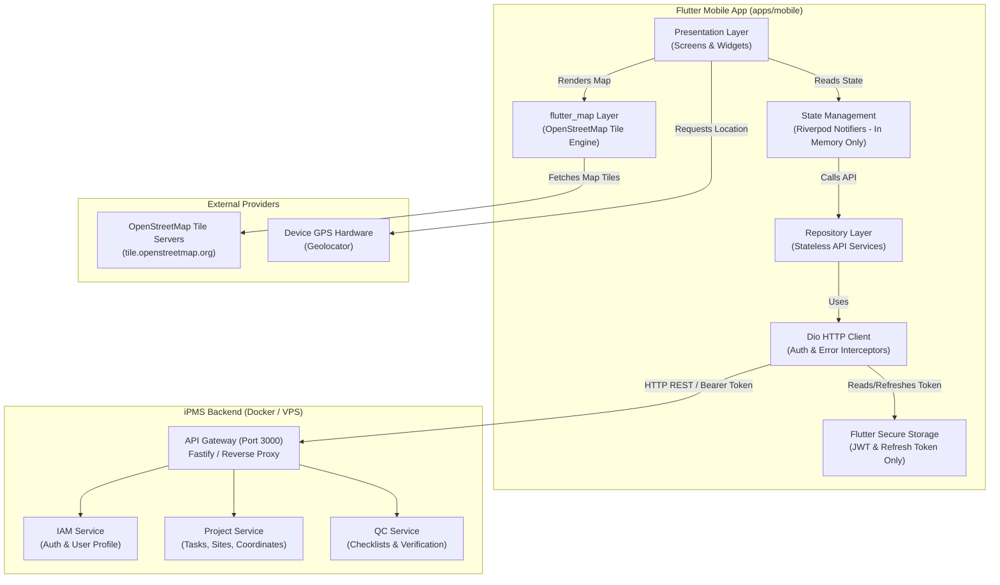
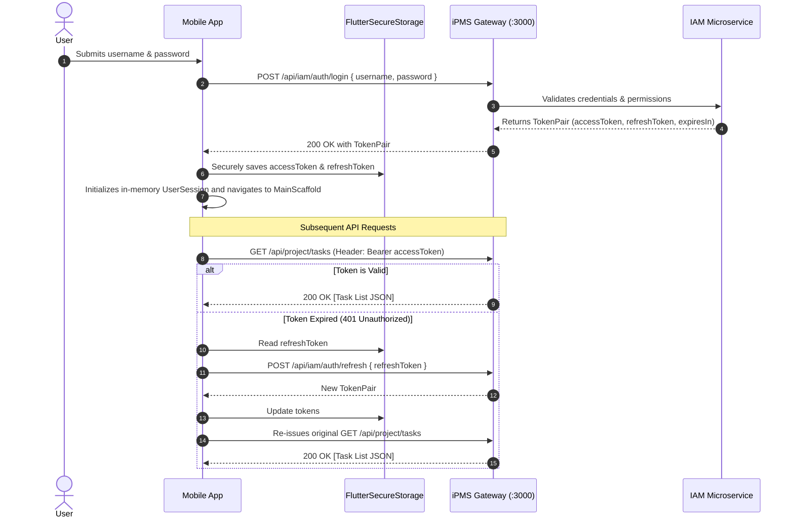
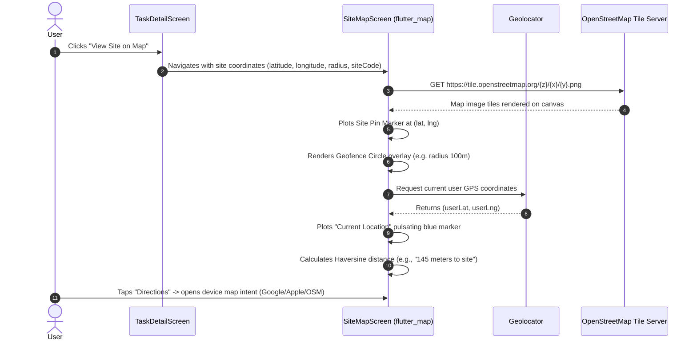

# iPMS Mobile App Architecture — Field Operations Client

**Document Version:** 1.0.0  
**Status:** Approved Architecture  
**Target Platform:** Flutter (Android & iOS)  
**Monorepo Location:** `apps/mobile/`  

---

## 1. Executive Summary & Philosophy

The **iPMS Mobile App** is the field client for the Integrated Project Management System. It empowers field engineers, technicians, and quality inspectors to track assigned tasks, inspect site details, navigate to site coordinates using interactive OpenStreetMap (OSM), and manage their profiles.

### Core Architectural Mandates
1. **Stateless Client (Zero Local Server-State Storage):**  
   The application **does not store server-side entity data locally** (no SQLite, Drift, Realm, or local database for projects, tasks, or sites). All operational data is retrieved live through REST APIs from the iPMS Gateway.
2. **Secure Minimalist Credential Storage:**  
   Device storage is restricted strictly to hardware-backed secure storage (`FlutterSecureStorage` via Android Keystore / iOS Keychain) solely holding the authentication tokens (`accessToken`, `refreshToken`) and session metadata.
3. **Open-Standard Mapping:**  
   Interactive geospatial mapping is powered entirely by **OpenStreetMap (OSM)** via `flutter_map` and `latlong2`, rendering vector tile layers without proprietary map SDK lock-in or licensing fees.
4. **Design Aesthetic:**  
   Implements a modern pastel & soft-contrast aesthetic matching the project design language: rounded cards (`BorderRadius.circular(20)`), floating pill bottom navigation, distinct priority badges, visual progress indicators, and intuitive status chips.

---

## 2. High-Level System Context & Data Flow



---

## 3. Technology Stack & Key Dependencies

| Component | Library / Tool | Purpose |
| :--- | :--- | :--- |
| **Framework** | Flutter 3.44+ / Dart 3.12+ | Cross-platform native mobile performance |
| **State Management** | `flutter_riverpod: ^2.6.1` | Declarative, compile-safe in-memory state management |
| **Networking** | `dio: ^5.8.0` | HTTP client with automatic request interception & retries |
| **Secure Storage** | `flutter_secure_storage: ^9.2.4` | Hardware-backed keystore/keychain for JWT tokens only |
| **Mapping Engine** | `flutter_map: ^7.0.2` & `latlong2: ^0.9.1` | Native OpenStreetMap rendering and marker management |
| **Geolocation** | `geolocator: ^13.0.2` | GPS coordinates retrieval & distance calculation |
| **Icons & Design** | `lucide_icons: ^0.257.0` | Consistent, modern outlined iconography |
| **Image Caching** | `cached_network_image: ^3.4.1` | Ephemeral in-memory/cache for remote avatars |

---

## 4. Layered Architecture & Directory Structure

The mobile codebase follows a feature-driven clean architecture under `apps/mobile/`:

```
apps/mobile/
├── pubspec.yaml
├── lib/
│   ├── main.dart                       # App entry point, Riverpod ProviderScope
│   ├── app.dart                        # MaterialApp, router config, global theme
│   ├── core/
│   │   ├── config/
│   │   │   ├── env.dart                # Gateway base URL & API timeouts
│   │   │   └── api_endpoints.dart      # Centralized REST route definitions
│   │   ├── network/
│   │   │   ├── api_client.dart         # Configured Dio singleton
│   │   │   ├── auth_interceptor.dart   # Injects Bearer token; handles 401 refresh
│   │   │   ├── error_interceptor.dart  # Formats API error envelopes to UserFriendlyExceptions
│   │   │   └── network_info.dart       # Live connectivity listener
│   │   ├── security/
│   │   │   └── token_storage.dart      # FlutterSecureStorage wrapper (Access & Refresh only)
│   │   └── theme/
│   │       ├── app_colors.dart         # Pastel lilac, mint, deep charcoal, accent shades
│   │       ├── app_typography.dart     # Modern font scales (GoogleFonts Inter/Outfit)
│   │       └── app_theme.dart          # Light & Dark theme definitions
│   │
│   ├── features/
│   │   ├── auth/                       # Authentication Feature
│   │   │   ├── data/auth_repository.dart
│   │   │   ├── presentation/login_screen.dart
│   │   │   └── providers/auth_provider.dart
│   │   │
│   │   ├── tasks/                      # Assigned Task List & Detail Feature
│   │   │   ├── domain/models/task.dart
│   │   │   ├── data/task_repository.dart
│   │   │   ├── presentation/
│   │   │   │   ├── task_list_screen.dart       # Assigned tasks with filters & progress
│   │   │   │   ├── task_detail_screen.dart     # Overview, subtasks, deadline, site details
│   │   │   │   └── widgets/
│   │   │   │       ├── task_card.dart          # Rounded card with badges & progress bar
│   │   │   │       ├── hero_progress_banner.dart# 3D clock illustration & progress stats
│   │   │   │       ├── status_filter_bar.dart  # Horizontal pill chips
│   │   │   │       └── avatar_stack.dart       # Overlapping circular assignee avatars
│   │   │   └── providers/task_providers.dart
│   │   │
│   │   ├── map/                        # OpenStreetMap Feature
│   │   │   ├── presentation/
│   │   │   │   ├── site_map_screen.dart        # Fullscreen interactive OpenStreetMap
│   │   │   │   └── widgets/
│   │   │   │       ├── site_marker_callout.dart# Site info popup card on marker tap
│   │   │   │       └── distance_pill.dart      # Live distance from user GPS to site
│   │   │   └── providers/location_provider.dart
│   │   │
│   │   ├── search/                     # Global & Task Search Feature
│   │   │   ├── presentation/search_screen.dart # Debounced search bar with filter drawer
│   │   │   └── providers/search_provider.dart
│   │   │
│   │   └── profile/                    # User Profile & Preferences
│   │       ├── domain/models/user_profile.dart
│   │       ├── data/profile_repository.dart
│   │       ├── presentation/
│   │       │   ├── profile_screen.dart         # Curved hero banner, settings list
│   │       │   └── edit_profile_dialog.dart
│   │       └── providers/profile_provider.dart
│   │
│   └── shared/
│       ├── layout/
│       │   ├── main_scaffold.dart      # Bottom navigation host
│       │   └── floating_nav_bar.dart   # Floating pill navigation bar
│       └── widgets/
│           ├── custom_button.dart
│           ├── priority_badge.dart
│           ├── status_badge.dart
│           ├── error_banner.dart
│           └── empty_state_widget.dart
```

---

## 5. UI/UX Design System (Inspired by Reference Designs)

The visual design language directly reflects the modern mobile mockups:

### Color Palette
- **Primary Lavender / Lilac**: `#DDD7F7` (card background highlights, hero header)
- **Soft Mint**: `#D1F2EB` / `#E8F8F5` (active task badges, ongoing status)
- **Deep Slate / Charcoal**: `#1E1E2F` (contrast chips, dark bottom bar, primary text)
- **Accent Yellow / Orange**: `#FFB84C` (clock illustration, deadline warnings)
- **Soft Background**: `#F8F9FE` (screen scaffold)
- **Surface White**: `#FFFFFF` (elevated cards with soft shadow `0 8px 24px rgba(0,0,0,0.04)`)

### Key UI Components
1. **Hero Progress Card (`hero_progress_banner.dart`)**:
   - Soft purple background containing "Mastering projects with management".
   - Inset dark pill showing remaining work ("7h 34m — Your task almost done") with a stylized 3D clock graphic.
2. **Task Card (`task_card.dart`)**:
   - Large rounded rectangle (`BorderRadius.circular(24)`).
   - Top row: Category icon, Task title, and Quick Edit action button.
   - Middle row: Status chip (`Ongoing` in soft mint), Priority chip (`High` with flag icon).
   - Bottom row: Linear progress bar (showing checklist progress), Assignee avatar stack (`+3`), and Date chip (`12 January`).
3. **Floating Pill Navigation (`floating_nav_bar.dart`)**:
   - Floating rounded capsule positioned 20px above the bottom safe area.
   - Tabs: `Home (Tasks)` | `Calendar` | `Search` | `Map` | `Profile`.
   - Smooth active-tab indicator animation.
4. **Profile View (`profile_screen.dart`)**:
   - Deep royal blue or lavender curved wave header.
   - Elevated circular avatar with camera edit badge.
   - User Name, Role/Designation ("Field Engineer - Civil & Telecom").
   - List options with soft chevron arrows: Account Settings, Notification Preferences, Dark Mode Toggle, Help & Support, Logout.

---

## 6. Detailed Component Workflows & API Communication

### 6.1 Authentication & Token Lifecycle Flow


---

### 6.2 Assigned Task List Flow
1. **Fetch on Mount:** The `TaskListScreen` watches `assignedTasksProvider`.
2. **API Call:** Sends `GET /api/project/tasks?assigneeId=me&status={selectedStatus}`.
3. **Rendering:** Maps JSON to immutable Dart `Task` models held solely in Riverpod state.
4. **Interactions:**
   - Filter chips dynamically re-query the API or filter the active view.
   - Tap on card navigates to `TaskDetailScreen(taskId: task.id)`.
   - Pull-to-refresh invalidates the provider and triggers an instant fresh network query.

---

### 6.3 OpenStreetMap (OSM) Site Location Flow


---

### 6.4 Search Flow
1. User enters keywords in the search bar (e.g., "KOS121", "Tower CW", "Ongoing").
2. The search provider debounces keystrokes by **300ms** to prevent API throttling.
3. Calls `GET /api/project/tasks?query={keyword}` and receives matching tasks.
4. Results render with highlighted keyword matches and quick-action buttons.

---

### 6.5 Profile Management Flow
1. Screen reads `/api/iam/users/me` on load.
2. Displays profile avatar, full name, email, assigned role, and account status.
3. Allows modifying display name / phone through `PATCH /api/iam/users/me`.
4. Logout action:
   - Calls `POST /api/iam/auth/logout`.
   - Clears all tokens from `FlutterSecureStorage`.
   - Resets all Riverpod providers in memory.
   - Redirects user to `LoginScreen`.

---

## 7. Zero Local Storage Enforcement

To satisfy the explicit constraint that **server-side information is never stored locally**:

| Layer | Policy | Enforcement Mechanism |
| :--- | :--- | :--- |
| **Database** | **Banned** | No SQLite / Drift / Hive / Isar / ObjectBox libraries in `pubspec.yaml` |
| **Cache** | **In-Memory Only** | Riverpod providers maintain state in RAM during the active session. If app is closed, memory clears |
| **Disk Storage** | **Tokens Only** | `flutter_secure_storage` is restricted to keys: `jwt_access_token`, `jwt_refresh_token` |
| **Offline Handling** | **Explicit Notice** | When offline, the app displays a graceful banner: *"No internet connection. Please reconnect to load tasks."* No stale cached task data is presented |

---

## 8. Step-by-Step Implementation Roadmap

1. **Step 1: Scaffold Flutter Project**
   - Initialize `apps/mobile` within the iPMS monorepo.
   - Configure `pubspec.yaml` with `flutter_riverpod`, `dio`, `flutter_map`, `latlong2`, `geolocator`, and `flutter_secure_storage`.
2. **Step 2: Core Design System & Network Client**
   - Define color tokens, typography, and themed button/card styles.
   - Implement `ApiClient` with Dio, `AuthInterceptor` (JWT handling), and error envelopes.
3. **Step 3: Authentication & User Session**
   - Implement `LoginScreen` with form validation.
   - Connect to `/api/iam/auth/login` and save tokens securely.
4. **Step 4: Assigned Task List & Hero Banner**
   - Build `HeroProgressBanner` with time remaining and progress stats.
   - Build `TaskCard` component matching Image 1 with status and priority chips.
   - Connect `TaskListScreen` to `/api/project/tasks`.
5. **Step 5: Task Details & Checklist View**
   - Build `TaskDetailScreen` with segmented tabs ("Checklist", "Site Details").
   - Display site address and location coordinates.
6. **Step 6: OpenStreetMap Integration**
   - Build `SiteMapScreen` using `flutter_map` with OpenStreetMap tile layer.
   - Plot site marker, geofence radius, and live user GPS location pin with distance calculator.
7. **Step 7: Search Screen**
   - Implement debounced live task search with filter chips.
8. **Step 8: Profile & Settings Screen**
   - Build `ProfileScreen` matching Image 2 with user info and settings items.
   - Implement secure logout.
